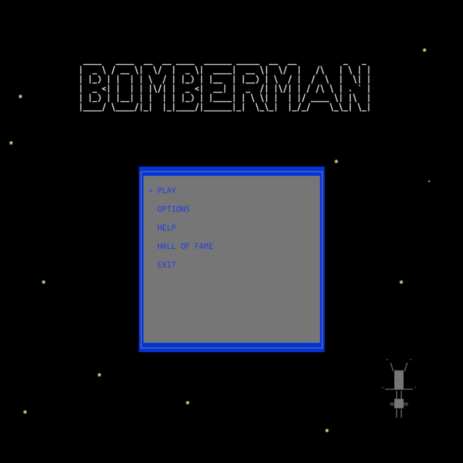

# ascii-bomb-ecs

Port of the [ascii-bomb](https://github.com/aleksa2808/ascii-bomb) game in Rust.

I ditched the `pdcurses` library used in the original and instead went with the [Bevy engine](https://bevyengine.org). This proved great for learning about the ECS paradigm, but it also made a [web build](https://aleksa2808.github.io/ascii-bomb-ecs/) possible!

As of recently there's also an [online multiplayer demo](https://github.com/aleksa2808/ascii-bomb-ecs-mp) available.

## Build

### Native

From the root folder run:

```bash
cargo run --release
```

### Web

From the root folder run:

```bash
wasm-pack build --target web --release
```

Then move the contents of `web` and the `assets` folder into `pkg`. After that, from the `pkg` folder you can start a local server by running:

```bash
# if basic-http-server is not yet installed
cargo install basic-http-server

basic-http-server
```

After that the game should be accessible on `localhost:4000`.

## Battle mode showcase


## Screenshots

### Main menu



### Story mode


### Battle mode


### Mobile controls

